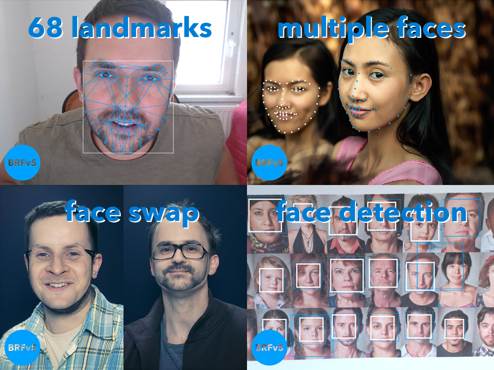

# Beyond Reality Face SDK - v5.0.0 (BRFv5) - Docs

+ [Docs / API](https://tastenkunst.github.io/brfv5-docs/)
+ [What can I do with it?](https://tastenkunst.github.io/brfv5-docs/what_can_i_do_with_it.html)

### Visit us online.

+ [GitHub (all repos)](https://github.com/Tastenkunst)
+ [BRFv5 Demo (platform: browser)](https://tastenkunst.github.io/brfv5-browser/)
+ [ARTOv5 - Augmented Reality Try-On based on BRFv5](https://tastenkunst.github.io/brfv5-browser/artov5)
+ [Website](https://www.beyond-reality-face.com)
+ [Facebook](https://www.facebook.com/BeyondRealityFace)
+ [Twitter](https://twitter.com/tastenkunst)

